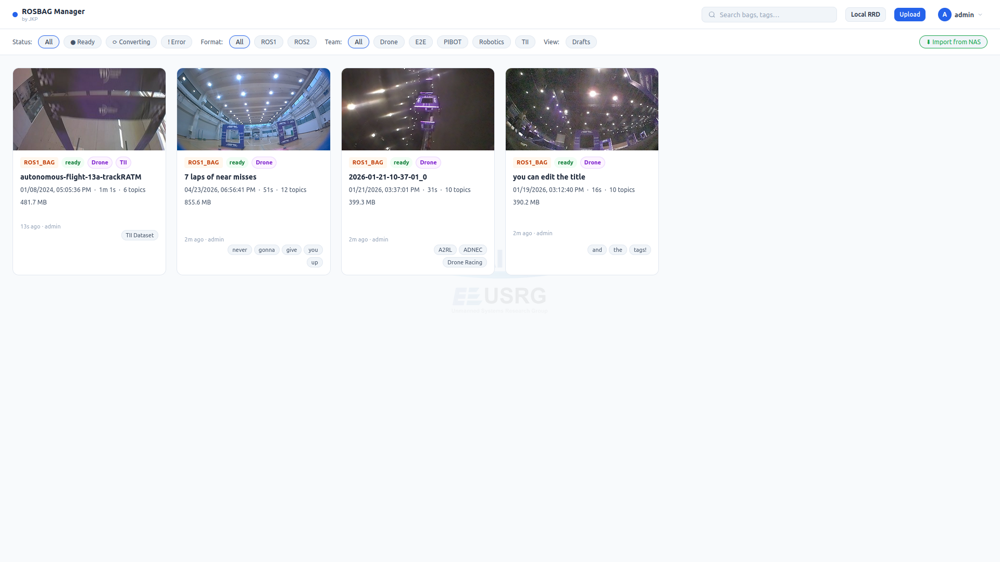
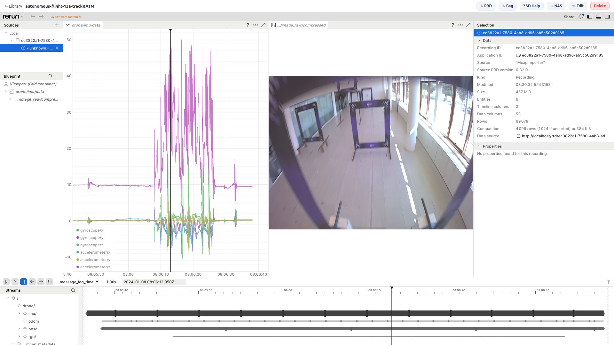

# ROSBAG Manager

A self-hosted web application for uploading, managing, converting, and visualizing ROS bag files (`.bag`, `.db3`, `.mcap`). Built by JKP at the [Unmanned Systems Research Group](https://unmanned.kaist.ac.kr) at KAIST.

Bags are converted to [Rerun](https://rerun.io) `.rrd` format and streamed directly in the browser via the Rerun web viewer — no desktop app required.

<table>
  <tr>
    <td></td>
    <td></td>
  </tr>
  <tr>
    <td align="center"><em>Bag library</em></td>
    <td align="center"><em>In-browser Rerun viewer</em></td>
  </tr>
</table>

## Features

- Upload ROS1 `.bag`, ROS2 `.db3`, and MCAP files
- Automatic conversion to `.rrd` via background Celery workers with live progress
- In-browser 3D visualization powered by [Rerun](https://rerun.io) — persistent modal viewer with animated loading progress bar (self-hosted, no CDN)
- Local RRD viewer — drag-and-drop any `.rrd` file without uploading to the server
- Tag, search, and filter bag library; click a tag chip to filter by it
- Draft/publish workflow — bags are hidden from the library until explicitly published
- Edit bag name, description, and tags after upload
- Synology NAS upload — send bags to NAS on demand with per-upload folder selection
- Live View with self-hosted [Lichtblick](https://github.com/lichtblick-suite/lichtblick); per-robot Lichtblick layout selection
- Role-based access: admin and regular users; per-user NAS upload and robot management privileges
- HTTPS support via Let's Encrypt with automatic certificate renewal
- Light/dark mode with VS Code-inspired dark theme, persisted across sessions

## Stack

| Component   | Technology |
|-------------|------------|
| Backend     | FastAPI + SQLAlchemy (async) + Alembic |
| Workers     | Celery + Redis |
| Database    | PostgreSQL 16 |
| Frontend    | Jinja2 templates + HTMX |
| Bag viewer  | Rerun web viewer (self-hosted) |
| Live viewer | Lichtblick (self-hosted, Foxglove Studio fork) |
| Proxy       | nginx |

## Quick Start (LAN / HTTP)

**Prerequisites:** Docker and Docker Compose v2.

```bash
git clone https://github.com/junekyoopark/rosbag-manager.git
cd rosbag-manager
cp .env.example .env
# Edit .env — set at minimum: POSTGRES_PASSWORD, SECRET_KEY, PUBLIC_HOST
mkdir -p data
docker compose build
docker compose up -d
docker compose exec backend alembic upgrade head
```

Open `http://<PUBLIC_HOST>` in your browser. On first visit, a setup wizard lets you create the admin account — or pre-set it in `.env` via `INITIAL_ADMIN_USERNAME` / `INITIAL_ADMIN_PASSWORD`.

> **Rebuilding without internet** (base images already pulled): `docker compose build --no-pull && docker compose up -d`

## HTTPS Deployment (public internet)

**Prerequisites:** A domain with an A record pointing to your server's public IP, and ports 80 + 443 forwarded to the server.

```bash
# 1. Add to .env:
#    DOMAIN=yourdomain.com
#    CERTBOT_EMAIL=admin@yourdomain.com
#    PUBLIC_HOST=yourdomain.com

# 2. Run the one-time certificate bootstrap:
chmod +x init-letsencrypt.sh
./init-letsencrypt.sh

# 3. Start the full stack with automatic certificate renewal:
docker compose --profile https up -d
```

On subsequent restarts, nginx automatically detects the certificate and uses HTTPS. Without a certificate it falls back to HTTP, so LAN deployments are unaffected.

## Configuration

| Variable | Required | Description |
|----------|----------|-------------|
| `POSTGRES_PASSWORD` | Yes | PostgreSQL password |
| `SECRET_KEY` | Yes | Random secret for sessions. Generate: `python3 -c "import secrets; print(secrets.token_hex(32))"` |
| `PUBLIC_HOST` | Yes | Hostname or IP shown to users (e.g. `192.168.1.10` or `yourdomain.com`) |
| `INITIAL_ADMIN_USERNAME` | No | Pre-create admin username. If omitted, a setup wizard runs on first visit. |
| `INITIAL_ADMIN_PASSWORD` | No | Pre-create admin password. Remove from `.env` after first login. |
| `DOMAIN` | HTTPS only | Domain name for Let's Encrypt certificate |
| `CERTBOT_EMAIL` | HTTPS only | Email for Let's Encrypt renewal failure alerts |
| `DATA_DIR` | No | Host path for bag data volume (default: `./data`) |
| `MAX_UPLOAD_SIZE_GB` | No | Upload size limit in GB (default: `50`) |
| `WORKER_CONCURRENCY` | No | Parallel conversion workers (default: `2`) |
| `STORAGE_BACKEND` | No | `local` (default) or `s3` for S3-compatible object storage |
| `S3_BUCKET` / `S3_ENDPOINT` | S3 only | Bucket name and endpoint URL for S3 storage |
| `AWS_ACCESS_KEY_ID` / `AWS_SECRET_ACCESS_KEY` | S3 only | S3 credentials |
| `FLOWER_BASIC_AUTH` | No | `user:password` to password-protect the Flower task monitor |

## Ports

| Port | Service |
|------|---------|
| 80   | nginx — HTTP (redirects to HTTPS when cert is present) |
| 443  | nginx — HTTPS |
| 5555 | Flower — Celery task monitor |

## Live View (Lichtblick)

The stack includes a self-hosted [Lichtblick](https://github.com/lichtblick-suite/lichtblick) instance (open-source Foxglove Studio fork) accessible at `http://<PUBLIC_HOST>/lichtblick/`.

Use it to visualize live ROS topics from a robot running [foxglove-bridge](https://github.com/foxglove/ros-foxglove-bridge):

```bash
# On the robot (ROS 2):
ros2 run foxglove_bridge foxglove_bridge
```

Then in Lichtblick → **Open connection** → WebSocket → `ws://<robot-ip>:8765`.

The **Live View** link in the navbar opens the Live View page. Each robot card has two buttons:

- **Lichtblick Direct** — connects straight to `ws://robot-ip:8765`, bypassing the server. Use when your browser is on the same LAN as the robot.
- **Lichtblick Proxy** — routes through the server's WebSocket relay. Use for remote access. Can be disabled per robot in Robot Management.

Both buttons pre-load a saved layout if one is assigned. Admins and robot managers can assign a default layout per robot and toggle proxy support from the Robot Management page.

## Updating

```bash
git pull
docker compose build backend worker   # only these two contain app code
docker compose up -d
docker compose exec backend alembic upgrade head
```

## Development

```bash
# Hot-reload for backend and frontend changes
docker compose -f docker-compose.yml -f docker-compose.dev.yml up --build
```

## Data & Backups

All persistent data lives under `DATA_DIR` (default `./data`):

| Path | Contents |
|------|----------|
| `data/uploads/` | Original uploaded bag files |
| `data/rrd/` | Converted Rerun `.rrd` files |
| `data/thumb/` | Thumbnail images |
| `data/certbot/` | TLS certificates (HTTPS deployments) |

Back up the `data/` directory and the PostgreSQL volume (`docker volume ls`) to preserve all bag data.
